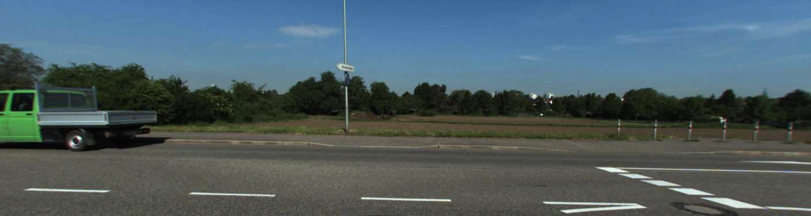
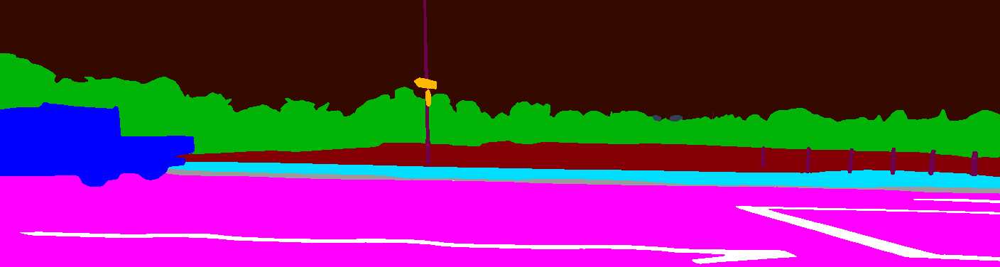
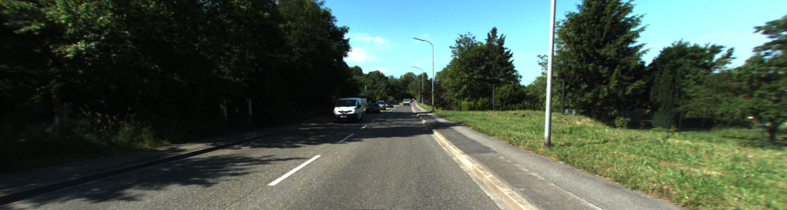
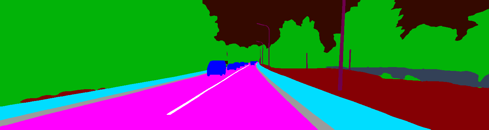

# Uniting Datasets
This repository consists scripts for converting Mapillary and Kitti 360 to the same class space and the scripts to use it. 

 - Link to [KITTI-360 dataset](http://www.cvlibs.net/datasets/kitti-360/).
 - Link to [Mapillary Vistas dataset](https://www.mapillary.com/dataset/vistas).
 - [HRNet](https://github.com/NVIDIA/semantic-segmentation) model used for labeling raw KITTI-360 to get Mapillary classes.

---
## How to use
### Prerequisites
 - Download weights for hrnet-ocr model (rattlesnake) from [here](https://drive.google.com/drive/folders/1fs-uLzXvmsISbS635eRZCc5uzQdBIZ_U) and place them in ```ss/seg_weights``` directory
 - Use docker to install dependencies
 - Navigate to docker/ and run ```sh build.sh```
 - Change paths to datasets in ```start.sh```
 - Run ```sh start.sh```
### Convert your images to Mapillary class format
To go through the first stage of conversion you need to launch inference of Mappilary trained model on your data:
 - Firstly, change necessary paths in ```scripts/dump_folder.yml``` file, do not change the dataset type
```
> python -m runx.runx scripts/dump_folder.yml -i
```
### Config description

### Convert images from Mapillary space to the requested
```
python3 conversion.py --data-dir /workspace/DIR/WITH/MAPILLARY/CLASSED/IMAGES --new-dir=/workspace/DIR/TO/SAVE/NEW/SPACE --config=config.csv
```
### Correction 
If you want to correct the images you got by using your GT, please go through ```correction.ipynb``` notebook. You need to change:
 - data_dir. What to correct
 - support_dir. GT folder
 - new_dir. Where to save new data
Then click through the whole notebook
## Description of resulting dataset
Resulting dataset consists of 94251 instances. KITTI-360 part: 76251 of them are labelled automatically and organized in sequences. 18000 are mapillary manual annotations with no temporal order. 
### Data organization

Data is organized in the way, which is convient both for training sequence models on KITTI-360 separately or non-sequence models on mixed data
```
    MKU | 94251 items
    ├── kitti360 | 76251 items
    │   ├── images 
    │       ├── 0 | 11518 items
    │       ├── 10 | 3836 items
    │       ├── 2 | 14385 items
    │       ├── 3 | 1031 items
    │       ├── 4 | 11587 items
    │       ├── 5 | 6743 items
    │       ├── 6 | 9699 items
    │       ├── 7 | 3396 items
    │       └── 9 | 14056 items
    │   └── labels
    │       ├── 0 | 11518 items
    │       ├── 10 | 3836 items
    │       ├── 2 | 14385 items
    │       ├── 3 | 1031 items
    │       ├── 4 | 11587 items
    │       ├── 5 | 6743 items
    │       ├── 6 | 9699 items
    │       ├── 7 | 3396 items
    │       └── 9 | 14056 items
    └── mapillary
        ├── images | 18000 items
        └── labels | 18000 items
```

### Examples

Here are some of the label instances:

| Image | Labeled image |
| :---------------- | :--------------- |
|||
|||


### Classes

| Class number | Class name | Color |
| :---------------- | :--------------- | :----- |
| 0 | background | 52,9,0 |
| 1 | static_obstacle | 51,65,87 |
| 2 | walk_zone | 0,221,255 |
| 3 | curb | 155,155,155 |
| 4 | road | 255,0,255 |
| 5 | sand_and_snow | 218,218,218 |
| 6 | water | 168,202,255 |
| 7 | banner | 119,119,119 |
| 8 | car | 0,0,255 |
| 9 | road_marking_general | 255,255,255 |
| 10 | person | 255,0,0 |
| 11 | terrain | 133,0,4 |
| 12 | vegetation | 2,179,8 |
| 13 | pole | 110,0,77 |
| 14 | traffic_sign | 255,183,0 |
| 15 | traffic_light | 255,255,0 |
| 16 | trash_can | 15,115,0 |
| 17 | cycle | 173,148,255 |
| 18 | ego_vehicle | 20,0,87 |
| 19 | road_marking_crosswalk | 214,255,249 |
| 20 | pothole | 133,13,252 |
